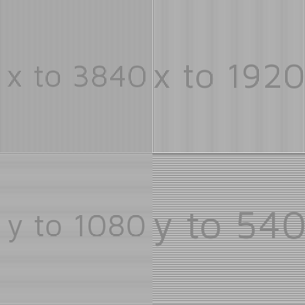
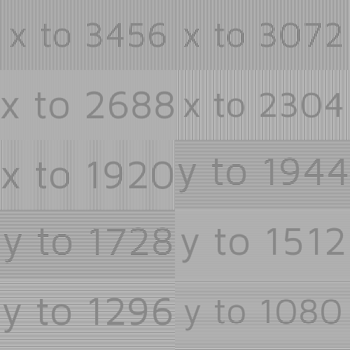
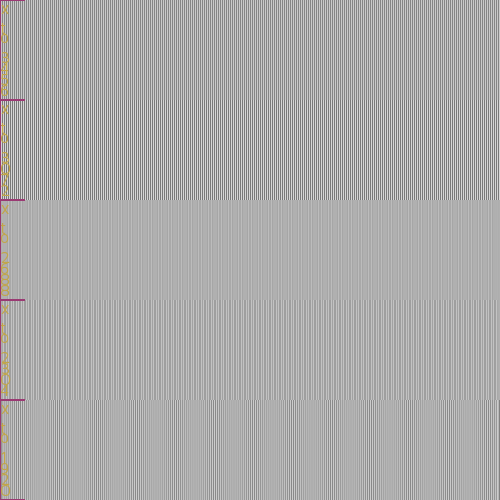

# Resize

This generates a series of resize detectors to fill the given area.
These resize detectors generate a visual cue for when a image has been resized,
so you can tell easily if the signal has been altered.
Each detector is a series of lines, with a text overlay describing the
direction being checked and the target resolution being checked for.

When resizing occurs one or more of the following happens to the pattern that is
watching for that resizing (e.g. 1920 to 1280 will change the 1280 detector and not
the 720 detector.):

- The background turns grey, leaving the text
- Grey banding, (bands of grey lines) in the direction you were checking for.

Please note it has the following limitations.

- It has a limited resolution for small changes, this means all patterns that
detect a change in resolution of less than half the base width
all produce the same banding pattern and
will all trigger in the same way. This is because you can't have half a pixel.
- Different resize algorithms produce different results on the same detectors,
so the collapse to grey may not be perfect.

It has the following optional fields:

- `xDetections` -  the x resolutions to check for, these shall be smaller thn the overall
width of the testcard. It follows the [distance unit rules][dur]
- `yDetections` - the y resolutions to check for, these shall be smaller thn the overall
width of the testcard. It follows the [distance unit rules][dur]
- `xStep` - A generated series of steps that are generated from the max x, of the width
declared, down to x = 0 or the value declared by `xStepEnd`. It follows the [distance unit rules][dur]
- `xStepEnd` - The end width for the generated x steps. It follows the [distance unit rules][dur]
- `yStep` - A generated series of steps that are generated from the max y, of the width
declared, down to y = 0 or the value declared by `yStepEnd`. It follows the [distance unit rules][dur]
- `yStepEnd` - The end width for the generated y steps. It follows the [distance unit rules][dur]
- `graticule` - Contains the fields that handle the graticule,
it has the following subfields:
  - `graticuleColor` - this sets the colour of the graticule, the default
value is `#F0F0F0`. It follows the [opentsg colour system][cgen]
  - `position` - the position of the graticule on the resize region,
valid values are :
    - `left`
    - `right`
    - `top`
    - `bottom`
  - `textColor`- this sets the colour of the text, the default
value is `#888888`. It follows the [opentsg colour system][cgen]

```json
{
    "grid": {
        "alias": " A demo alias",
        "location": "a1"
    },
    "type": "builtin.resize",
    "xDetections": [
        "3840px",
        "1920px"
    ],
    "yDetections": [
        50,
        "25%"
    ],
    "graticule": {
        "graticuleColor": "#9A3A73",
        "position": "left",
        "textColor": "#C2A649"
    },
    "xStep": "10%",
    "xStepEnd": "50%",
}
```

Here are some further examples and their output:

- [pixel-example.json](../exampleJson/builtin.resize/pixel-example.json)



- [limitedStepper.json](../exampleJson/builtin.resize/limitedStepper-example.json)



- [graticule.json](../exampleJson/builtin.resize/graticule-example.json)



[dur]: ../../opentsg-core/parameters/readme.md#offset "the parameter readme, linked to the section about offsets"
[cgen]: ../../opentsg-core/colourgen/readme.md "the pcolourgen readme"
